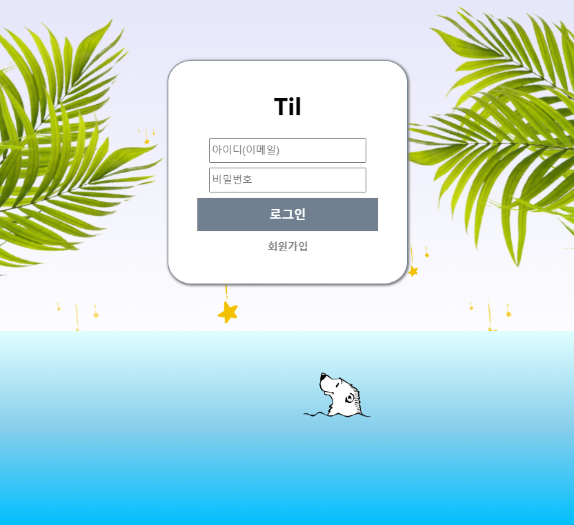

# Til List
## 유저 간의 TIL 공유 웹 애플리케이션

### TIL을 작성하고 공유합니다. 
시연 영상: https://youtu.be/Ze7oQq7qyFs<br/><br/>



Firebase의 Authentication으로 회원 가입과 로그인이 가능합니다. <br/>
회원가입 후에 로그인을 하면 모든 유저들의 TIL들과 활동 순위를 볼 수 있습니다. 특정 TIL을 클릭하면 그 TIL을 적은 유저의 총 TIL을 확인할 수 있습니다. <br/>또한, 현재 개인 정보를 수정하거나 로그아웃을 할 수 있습니다. <br/><br/>

## 추가한 프로그램, 라이브러리
[yarn](https://yarnpkg.com/)

- Javascript의 Package Manager입니다.
- package.json을 통해 의존 패키지를 구분하고 프로젝트에서 어떤 일을 할지 결정합니다.

```html
npm install [-g(선택)] yarn
```

[CRA(Create React App)](https://create-react-app.dev/)

- CRA를 통해 React App을 만듭니다.

```html
yarn create react-app [만들 프로젝트명]
```

[react-router-dom](https://v5.reactrouter.com/web/guides/primary-components)

- 페이지 전환을 위한 패키지입니다.

```html
yarn add react-router-dom
```

[Redux](https://ko.redux.js.org/introduction/getting-started/)

- 상태 관리 라이브러리입니다.

```html
yarn add redux react-redux
```

[firebase Authentication & Storage](https://firebase.google.com/)

- 회원 가입과 로그인, 사진을 관리합니다.

```html
yarn add firebase
```

[Axios](https://axios-http.com/)

- HTTP 비동기 통신 라이브러리입니다.

```html
yarn add axios
```

[json-server](https://www.npmjs.com/package/json-server)

- REST API Mock server를 구축할 수 있는 툴입니다.

```html
yarn add json-server
```

## 추가한 CSS 자료

[styled-components](https://styled-components.com/)

- 직관적인 코드로 쉽게 사용할 수 있습니다.

```html
yarn add styled-components
```
